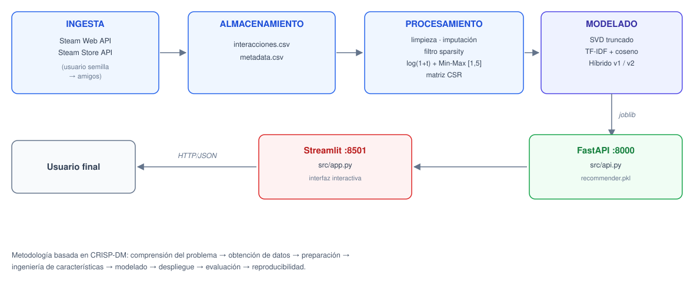

# 🎮 SteamRec: sistema híbrido de recomendación de videojuegos

> **Trabajo Fin de Máster**: *Diseño e implementación de un sistema híbrido de recomendación de videojuegos a partir de datos de interacción de Steam*
> Máster Universitario en Análisis y Visualización de Datos Masivos / Visual Analytics and Big Data, **Universidad Internacional de La Rioja (UNIR)**
> **Autor:** Luis Emilio Vásquez Vera · **Director:** Mario Modesto Mata · **Fecha:** julio de 2026


---

## 📌 Descripción

Entre 2020 y 2025, el número de juegos publicados al año en Steam pasó de **9.646 a 21.509** (SteamDB, 2026). Con catálogos tan grandes, a los jugadores les cuesta encontrar títulos que encajen con sus gustos.

**SteamRec** es un prototipo completo de recomendación que:

1. **Extrae** datos reales desde **Steam Web API** y **Steam Store API**: bibliotecas públicas, tiempo de juego y metadatos de los títulos.
2. **Transforma** el tiempo de juego en una **señal implícita de preferencia** con `log(1+x)` y normalización Min-Max por usuario a la escala [1, 5].
3. **Combina** varios enfoques de recomendación:
   - **Filtrado colaborativo** con **SVD truncado** sobre una matriz dispersa usuario × videojuego en formato CSR.
   - **Recomendación basada en contenido** con **TF-IDF + similitud del coseno** sobre géneros y categorías.
   - **Híbrido v1 (condicional):** usa SVD si el usuario es conocido y TF-IDF en caso de *cold start*, con un ajuste final por Metacritic.
   - **Híbrido v2 (ponderado):** combina SVD, contenido, popularidad, Metacritic y novedad, con re-ranking **MMR** opcional para dar diversidad.
4. **Sirve** las recomendaciones mediante una **API REST (FastAPI)** y una **interfaz web (Streamlit)**.
5. **Evalúa** los modelos offline con Precision@K, Recall@K, NDCG@K, Coverage, Diversity y Novelty.

---

## 🏗️ Arquitectura



La metodología sigue un ciclo de vida del dato inspirado en **CRISP-DM**: comprensión del problema, obtención de datos, preparación, ingeniería de características, modelado, despliegue, evaluación y reproducibilidad.

---

## 📁 Estructura del repositorio

```text
.
├── data/
│   ├── matriz_interacciones_test.csv   # steam_id, app_id, playtime_forever_min
│   └── juegos_metadata.csv             # metadatos de videojuegos (Steam Store API)
├── models/
│   └── recommender.pkl                 # modelo entrenado (se genera con train.py)
├── src/
│   ├── model.py                        # clase SteamRecommender: SVD, TF-IDF, híbrido v1 y v2, MMR
│   ├── train.py                        # carga, limpieza, entrenamiento y serialización
│   ├── api.py                          # API REST con FastAPI
│   └── app.py                          # interfaz web con Streamlit
├── evaluation_results/                 # métricas Top-N, resúmenes y ejemplos cualitativos
├── extraccion_datos_steamAPI.py        # extracción de datos desde las APIs de Steam
├── evaluate_recommender.py             # evaluación offline y búsqueda de pesos del híbrido v2
├── requirements.txt
├── .env.example                        # plantilla de variables de entorno
└── .gitignore
```

---

## 📊 Datos

| Dataset | Campos principales | Uso |
|---|---|---|
| **Interacciones** (`matriz_interacciones_test.csv`) | `steam_id`, `app_id`, `playtime_forever_min` | Ratings implícitos y matriz usuario × videojuego |
| **Metadatos** (`juegos_metadata.csv`) | `app_id`, `nombre`, `tipo`, `desarrolladores`, `publicadores`, `fecha_lanzamiento`, `plataformas`, `generos`, `categorias`, `tecnologias`, `precio_inicial`, `metacritic`, `edad_requerida` | TF-IDF, señales del híbrido v2 y presentación de resultados |

**Volumen procesado**

| Métrica | Valor |
|---|---|
| Interacciones originales | 414.809 |
| Tras el filtrado de *sparsity* (≥5 interacciones/usuario, ≥10/juego) | 389.371 |
| Interacciones de entrenamiento | 380.752 |
| Interacciones de test | 8.619 |
| Catálogo evaluable | 3.328 videojuegos |

**Preprocesamiento clave**

- Los valores de Metacritic ausentes o no válidos se imputan con **50.0**, un valor neutro.
- El rating implícito es `rating = 1 + 4 · (x − min) / (max − min)`, con `x = log(1 + playtime)` calculado **por usuario**. Si todos los valores de un usuario son iguales, se le asigna **3.0**.

---

## 🧠 Modelos

### Híbrido v2 ponderado

```text
score_final = 0.35·score_svd + 0.15·score_content + 0.30·score_popularity
            + 0.15·score_metacritic + 0.05·score_novelty
```

| Señal | Descripción | Objetivo |
|---|---|---|
| `score_svd` | Afinidad estimada por el modelo colaborativo | Personalizar a partir de patrones latentes |
| `score_content` | Similitud TF-IDF con el historial o con los juegos semilla | Afinidad semántica por géneros y categorías |
| `score_popularity` | Popularidad normalizada | Aportar una señal de aceptación general |
| `score_metacritic` | Metacritic normalizado | Aportar una señal externa de calidad |
| `score_novelty` | Popularidad relativa inversa | Favorecer la exploración del catálogo |

Los pesos se pueden ajustar desde la API y desde la interfaz. **MMR** (*Maximal Marginal Relevance*) se puede activar para reducir la redundancia entre recomendaciones.

---

## 🚀 Instalación y uso

### 1. Entorno

```bash
python -m venv venv
# Windows (PowerShell)
.\venv\Scripts\Activate.ps1
# Linux / macOS
source venv/bin/activate

python -m pip install --upgrade pip
pip install -r requirements.txt
```

Dependencias: `pandas`, `numpy`, `scikit-learn`, `scipy`, `fastapi`, `uvicorn`, `streamlit`, `joblib`, `requests`, `python-dotenv`, `tabulate`.

### 2. Credenciales

```bash
cp .env.example .env
```

```ini
STEAM_API_KEY=tu_clave_de_steam        # https://steamcommunity.com/dev/apikey
MODEL_PATH=models/recommender.pkl
```

> ⚠️ `.env` está en `.gitignore`. **No subas nunca tu clave al repositorio.**

### 3. (Opcional) Extraer datos nuevos

```bash
python extraccion_datos_steamAPI.py
```

### 4. Entrenar el modelo

```bash
python src/train.py        # genera models/recommender.pkl
```

### 5. Lanzar la API (backend)

```bash
python -m uvicorn src.api:app --reload
```

La documentación Swagger queda disponible en **http://localhost:8000/docs**.

### 6. Lanzar la interfaz (frontend)

```bash
python -m streamlit run src/app.py
```

La interfaz se abre en **http://localhost:8501**.

La interfaz tiene dos modos:

- **Por Steam ID:** muestra el perfil público y genera recomendaciones con el híbrido v2 o con SVD / híbrido v1. Permite ajustar los pesos y activar MMR.
- **Por juegos de referencia:** genera recomendaciones por contenido a partir de los juegos que elijas.

Cada recomendación se muestra en una tarjeta con portada, título, género, descripción, etiqueta (*Imprescindible*, *Muy recomendado* o *Recomendado*) y enlace a Steam.

### 7. Evaluación offline

```bash
python evaluate_recommender.py --k_values 5 10 20 --sample_users 1000
python evaluate_recommender.py --k_values 5 10 20 --sample_users 1000 --use_mmr
python evaluate_recommender.py --grid_search --grid_sample_users 300 --sample_users 1000
```

Los resultados se guardan en `evaluation_results/`.

---

## 🔌 Endpoints de la API

| Endpoint | Método | Descripción |
|---|---|---|
| `/` | GET | Estado de la API y carga del modelo |
| `/profile/{steam_id}` | GET | Perfil público desde Steam API (nick, avatar, juegos, horas, más jugados) y datos del modelo (`known_user`, `training_games`, `training_interactions`) |
| `/recommend/collaborative/{steam_id}?n=5` | GET | Recomendaciones SVD / híbrido v1 |
| `/recommend/hybrid-v2/{steam_id}?n=8` | GET | Híbrido v2 ponderado. Acepta `alpha_svd`, `beta_content`, `gamma_popularity`, `delta_metacritic`, `epsilon_novelty` y `use_mmr` |
| `/recommend/content/?n=5` | POST | Recomendaciones por contenido. Cuerpo: `{"games": ["Portal 2", "Hades"]}` |

**Ejemplo:**

```bash
curl "http://localhost:8000/recommend/hybrid-v2/76561198000000000?n=8&use_mmr=true"
```

Si el usuario no está en la matriz de entrenamiento, la API intenta hacer un *cold start* con los juegos más jugados de su biblioteca pública. Si Steam no devuelve la biblioteca, la API indica que no está disponible en lugar de mostrar 0 juegos.

---

## 📈 Resultados

Evaluación offline **leave-one-out** con **K = 5**, tal como aparece en la memoria:

| Modelo | Precision@5 | Recall@5 | NDCG@5 | Coverage |
|---|---:|---:|---:|---:|
| Baseline de popularidad | **0.0180** | **0.0900** | **0.0606** | 0.0063 |
| Colaborativo SVD | 0.0142 | 0.0710 | 0.0525 | 0.0526 |
| Contenido TF-IDF | 0.0012 | 0.0060 | 0.0032 | **0.4177** |
| Híbrido v1 | 0.0138 | 0.0690 | 0.0513 | 0.0466 |

**Interpretación**

- El **baseline de popularidad** gana en las métricas de acierto, pero solo recomienda **21 juegos distintos** de un catálogo de 3.328. Es la tensión habitual entre **precisión y cobertura**.
- **TF-IDF** tiene la mayor cobertura, pero poco acierto, porque solo usa metadatos de alto nivel como los géneros.
- **SVD** y el **híbrido v1** quedan en un punto intermedio. El híbrido v1 se comporta casi igual que SVD con usuarios conocidos, y esa observación llevó a diseñar el **híbrido v2 ponderado**.

Las métricas por K = 5, 10 y 20, junto con Diversity y Novelty del híbrido v2, están en `evaluation_results/topn_metrics_v2.csv` y `evaluation_summary_v2.md`.

---

## 🔒 Privacidad y marco normativo

El proyecto sigue los principios del **RGPD** y de la **LOPDGDD 3/2018**:

- **Minimización:** solo se usan `steam_id`, `app_id`, el tiempo de juego y los metadatos de los juegos. No se usan nombres, emails, chats, ubicación ni datos de pago.
- El **Steam ID es un pseudónimo, no un dato anónimo**. Si publicas los datasets fuera del ámbito académico, sustituye los IDs por identificadores internos no reversibles o publica solo datos agregados.
- Las credenciales van en `.env` y el repositorio solo incluye `.env.example`.
- Es un proyecto académico, sin fines comerciales y sin decisiones automatizadas con efectos jurídicos.

---

## ⚠️ Limitaciones

- La muestra depende de los perfiles públicos y de la red de amigos del usuario semilla, lo que puede introducir **sesgo muestral**.
- El tiempo de juego es una señal implícita que **no siempre refleja satisfacción**.
- La matriz es muy dispersa y el filtrado deja fuera a jugadores casuales y juegos minoritarios.
- El modelo de contenido se basa solo en géneros y categorías.
- La evaluación leave-one-out tiende a favorecer a la popularidad. Falta validar con particiones temporales y con usuarios reales.
- Es un prototipo local: no tiene Docker, autenticación, monitorización ni almacenamiento persistente de feedback.

## 🔭 Trabajo futuro

- Enriquecer los metadatos con descripciones, etiquetas de la comunidad y reseñas.
- Probar **ALS** o **Neural Collaborative Filtering** y escalar con **Apache Spark / MLlib**.
- Optimizar los pesos del híbrido v2 con una validación más amplia y añadir métricas de serendipia.
- Recoger feedback explícito ("me gusta", "no me interesa") para aprendizaje *online*.
- Desplegar en la nube con **Docker** y un proveedor cloud (AWS, GCP o Azure), y añadir una base de datos para logs y métricas de uso.
- Mostrar en la interfaz por qué se recomienda cada juego.

---

## 📚 Referencias principales

- Koren, Y., Bell, R., Volinsky, C. (2009). *Matrix Factorization Techniques for Recommender Systems*. IEEE Computer. https://doi.org/10.1109/MC.2009.263
- Burke, R. (2002). *Hybrid recommender systems: Survey and experiments*. User Modeling and User-Adapted Interaction.
- Ricci, F. et al. (2010). *Recommender Systems Handbook*. Springer.
- Salton, G., Buckley, C. (1988). *Term-weighting approaches in automatic text retrieval*.
- Chapman, P. et al. (2000). *CRISP-DM 1.0*.
- Valve Corporation (2026). *Steamworks Web API Documentation*. https://partner.steamgames.com/doc/api
- SteamDB (2026). *Games released on Steam*. https://steamdb.info/stats/releases/

---

## 👤 Autor

**Luis Emilio Vásquez Vera**, Máster en Análisis y Visualización de Datos Masivos (UNIR)

*Steam es una marca de Valve Corporation. Este proyecto es académico y no está afiliado a Valve.*
